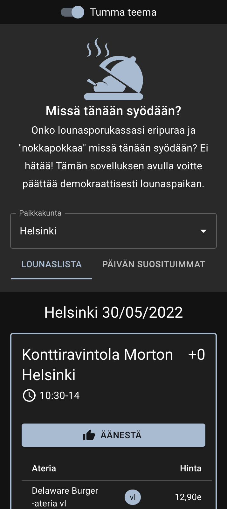
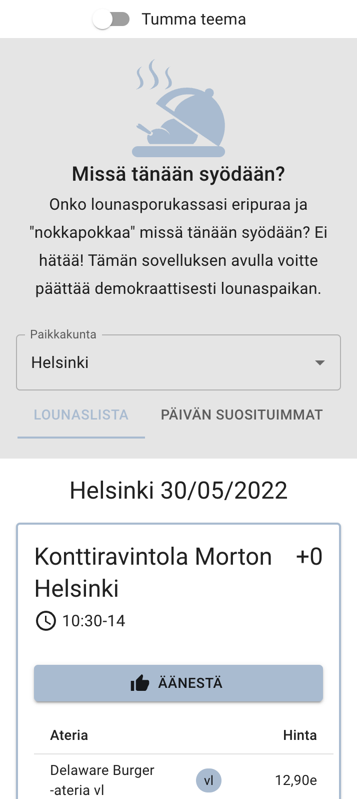
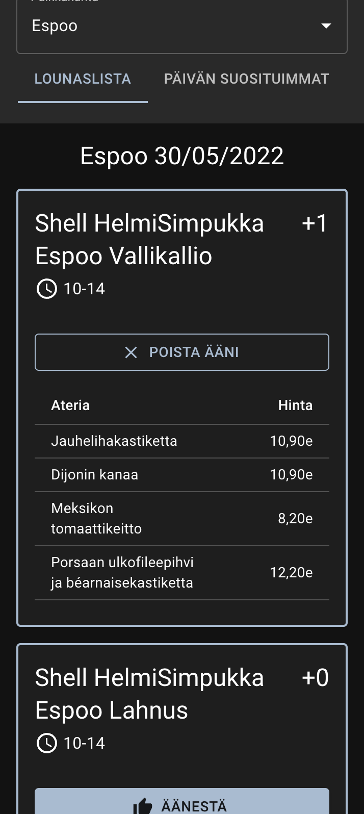
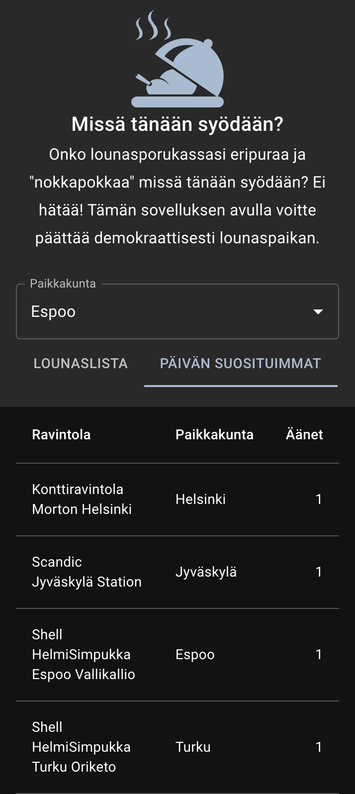

# Yleistä

Devauksessa on hyödynnetty dockeria ja docker-composea. Jotta toteutuksen saa lokaalisti käyntiin täytyy ajaa seuraavat komennot kansion juuressa:
> docker-compose build

> docker-compose up

Nämä komennot käynnistävät sekä frontendin, että backendin. Tämän jälkeen voi avata selaimeen http://localhost:3000/ ja sovelluksen kuuluisi toimia.

# Backend

Backendissä käytin valmista docker imagea ja täten backendin toimintaan ei tullut muutoksia.

# Frontend

Frontend on toteutettu ReactJS avulla sekä Material UI kirjaston komponenteilla. 

# Kuvia

## Tumma teema

## Vaalea teema

## Lounaslista

## Päivän suosituimmat

# Testit
Testit oli tarkoitus tehdä Cypressin (e2e) avulla, mutta ilmeni, että MacBook M1 prosessorilla ja Cypressin docker imagella se on haastavaa ellei mahdotonta eikä aika enää riittänyt selvittämään vaihtoehtoisia toteutuksia.

https://github.com/cypress-io/cypress-docker-images/issues/431